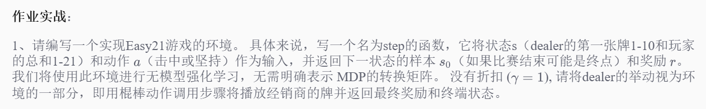
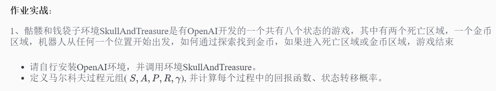
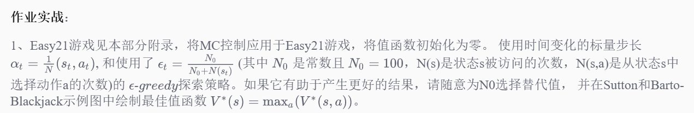
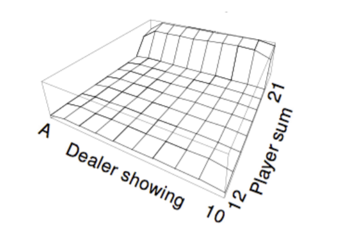

# UCL-DeepReinforcementLearning
一门由AlphaGo项目负责人David Sliver，在UCL(伦敦大学)主讲的强化学习经典课程


# UCL深度强化学习课程学习项目

## 课程资料
1. [课程主页](http://www0.cs.ucl.ac.uk/staff/d.silver/web/Teaching.html)  
2. [中文笔记](https://zhuanlan.zhihu.com/reinforce)  
3. [课程视频](https://space.bilibili.com/74997410#!/)  
4.  实验环境推荐使用Linux或者Mac系统，以下环境搭建方法皆适用:  
    [Docker环境配置](https://github.com/ufoym/deepo)  
    [本地环境配置](https://github.com/learning511/cs224n-learning-camp/blob/master/environment.md)

#### 重要资源汇总：
5. [强化学习简介：Google DeepMind](https://deepmind.com/blog/deep-reinforcement-learning/)
6. [强化学习简介：DeepMind--David Sliver](https://icml.cc/2016/tutorials/deep_rl_tutorial.pdf)
9. [本人博客(强化学习算法专题)](https://blog.csdn.net/dukuku5038)
10. [书籍《Reinforcement Learning: An Introduction》](https://webdocs.cs.ualberta.ca/~sutton/book/bookdraft2016sep.pdf)  
10. [书籍《Algorithms for Reinforcement Learning》](https://sites.ualberta.ca/~szepesva/RLBook.html)
11. [书籍《Deep Learning》](http://www.deeplearningbook.org/)  
11. [李宏毅课程《Deep Learning》](https://www.slideshare.net/tw_dsconf/ss-62245351）)


## 前言
如今机器学习发展如此迅猛，各类算法层出不群，特别是深度神经网络在计算机视觉、自然语言处理、时间序列预测等多个领域都更是战果累累，可以说这波浪潮带动了很多人进入深度学习领域，也成就了其一番事业。而强化学习作为一门灵感来源于心理学中的行为主义理论的学科，其内容涉及概率论、统计学、逼近论、凸分析、计算复杂性理论、运筹学等多学科知识，难度之高，导致其发展速度特别慢。 **但是**，作为人类棋牌类游戏中复杂度最大的围棋,

> + 2015年10月，由Google DeepMind公司开发的AlphaGo程序击败了人类高级选手樊麾，成为第一个无需让子即可在19路棋盘上击败围棋职业棋手的计算机围棋程序，并写进了历史，论文发表在国际顶级期刊《Science》上。
+ 2016年3月，透过自我对弈数以万计盘进行练习强化，AlphaGo在一场五番棋比赛中4:1击败顶尖职业棋手李世石。
+ Master(AlphaGo版本)于2016.12.29开始出现于弈城围棋网和腾讯野狐围棋网，取得60连胜的成绩，以其空前的实力轰动了围棋界。
>+ DeepMind 如约公布了他们最新版AlphaGo论文(Nature)，介绍了迄今最强最新的版本AlphaGo Zero，使用纯强化学习，将价值网络和策略网络整合为一个架构，3天训练后就以100比0击败了上一版本的AlphaGo。AlphaGo已经退休，但技术永存。DeepMind已经完成围棋上的概念证明，接下来就是用强化学习创造改变世界的价值。

围棋的发展证明了强化学习的威力，作为AlphoGo的带头人,强化学习的鼻祖Richard S.Sutton的弟子，David Sliver及其团队可以说盛名远扬。其以前沿的目光发表了人工智能的终极目标是：

### **AI = Deep Learning + Reinforcement Learning** ###

深度学习已经取得了很大的进步，而深度强化学习真正的发展归功于神经网络、深度学习以及计算力的提升，David就是使用了神经网络逼近值函数后，开启了一门新的研究方向，又一发不可收拾的证明了确定性策略等，纵观近四年的ICML,NPIS等会议论文，强化学习的理论进步，应用领域逐渐爆发式增广，目前已经应用在各个领域，同时，纵观世界出名研究机构，诸如：DeepMind、OpenAI, 伯克利、CMU等，可以说是强化学习的领跑者，并研究除了很多最新的科技，本课程以上述机构课程、论文为基础，将会从强化学习原理及以上相关应用例子开始逐渐庖丁解牛，最终让每个人都能够享受DRL带来的乐趣、并完成世界最著名的围棋程序"Alpha Zero"原理与代码实战。


## 知识要求(边用边复习）
>注：由于强化学习整体来说难度比较高，需求的知识面也比较宽广，部分知识需要先修，但具体以应用时候选择性的学习即可。

- 了解python基础知识，高等数学、概率论、线性代数知识
- 了解基础机器学习算法：梯度下降、线性回归、逻辑回归、Softmax、SVM、PAC、神经网络、凸优化、函数逼近理论
- 了解Tensorflow基本编程


## 知识工具
为了让大家逐渐适应英文阅读，复习材料我们有中英两个版本，**但是推荐大家读英文**
#### 斯坦福资料：
- [线性代数](http://web.stanford.edu/class/cs224n/readings/cs229-linalg.pdf)  
- [概率论](http://web.stanford.edu/class/cs224n/readings/cs229-prob.pdf)  
- [凸函数优化](http://web.stanford.edu/class/cs224n/readings/cs229-cvxopt.pdf)  
- [随机梯度下降算法](http://cs231n.github.io/optimization-1/)  
#### 中文资料：    
- [机器学习中的数学基本知识](https://www.cnblogs.com/steven-yang/p/6348112.html)  
- [统计学习方法](http://vdisk.weibo.com/s/vfFpMc1YgPOr)  
**大学数学课本（从故纸堆里翻出来^_^）**  

### 编程工具
#### 斯坦福资料：
- [Python复习](http://web.stanford.edu/class/cs224n/lectures/python-review.pdf)  
- [TensorFlow教程](https://github.com/open-source-for-science/TensorFlow-Course#why-use-tensorflow)  
#### 中文资料：
- [廖雪峰python3教程](https://www.liaoxuefeng.com/article/001432619295115c918a094d8954bd493037b03d27bf9a9000)  
- [莫烦TensorFlow教程](https://morvanzhou.github.io/tutorials/machine-learning/tensorflow/)

## 学习安排
每周具体时间划分为4个部分:  
- 1部分安排周一到周二  
- 2部分安排在周四到周五  
- 3部分安排在周日  
- 4部分作业是本周任何时候空余时间    
- 周日晚上提交作业运行截图  
- 周三、周六休息

#### 作业提交指南：  
 训练营的作业自检系统已经正式上线啦！只需将作业发送到训练营公共邮箱即可，训练营以打卡为主，不用提交作业。以下为注意事项:  
<0> 课程资料：[链接](https://pan.baidu.com/s/1p1J9kyoNZIwqCRmaX6lvoQ) 密码：zwjr  
<1> 训练营代码公共邮箱：cs224n@163.com  
<2> 每周做作业，作业提交时间点：一整个Assignment代码全部完成后再提交  
<3> 将每次作业压缩成zip文件，文件名为“深度强化学习学期+学号+作业编号”，例如第二期学员："DRL020037-01.zip"  
<4> 注意不要改变作业中的《方法名》《类名》不然会检测失败！！  
<5> [查询自己成绩:]()  
 
##  教程  
### Week1
1. 强化学习原理简介  
+ 强化学习思想来源
+ 与机器学习之间的联系与区别
+ 强化学习机理及组成元素
+ 策略、值函数、模型
+ 基于模型、非基于模型
+ 学习和规划
+ 探索和利用
+ 预测与控制
+ **实例讲解： Maze游戏中的强化学习理解**



>
- **课件:** [lecture01](http://www0.cs.ucl.ac.uk/staff/d.silver/web/Teaching_files/intro_RL.pdf)
- [观看视频1](https://www.bilibili.com/video/av9831889)
- **学习笔记**：[强化学习原理简介](https://blog.csdn.net/dukuku5038/article/details/84273813)

### Week2

1. 马尔科夫
+ 马尔科夫过程
+ 马尔科夫奖励过程
+ **实例讲解：学生成绩及课程决策过程**
+ 马尔科夫决策过程



>
- **课件:** [lecture02](http://www0.cs.ucl.ac.uk/staff/d.silver/web/Teaching_files/MDP.pdf)
- [观看视频2](https://www.bilibili.com/video/av9833386)
- **学习笔记**： [马尔可夫决策过程](https://blog.csdn.net/dukuku5038/article/details/84361371)

### Week3
1. 动态规划算法简介
+ 迭代法策略评估
+ 策略迭代 Policy Iteration
+ 价值迭代 Value Iteration
+ 动态规划的一些扩展(异步动态规划、采样更新、近似动态规划)


>**作业实战**：
>
>1、请完成策略改善的伪代码实现过程，向其中添加贪心策略, 并完成下面代码。
```python
def policy_improve(self, grid_map)
    for state in grid_map.states:
    ...
    ...
    ...
    ## 贪心策略
    ...


```


>
- **课件:** [lecture03](http://www0.cs.ucl.ac.uk/staff/d.silver/web/Teaching_files/DP.pdf)
- [观看视频3](https://www.bilibili.com/video/av9930653)
- **学习笔记:** [动态规划寻找最优策略](https://blog.csdn.net/dukuku5038/article/details/84516559)


### Week4
1. 不基于模型的预测简介
+ 蒙特卡洛强化学习 Monte-Carlo Reinforcement Learning
+ 时序差分学习 Temporal-Difference Learning
+ DP、MC、TD之间的对比
+ λ时序差分强化学习






>
- **课件:** [lecture04](http://www0.cs.ucl.ac.uk/staff/d.silver/web/Teaching_files/MC-TD.pdf)
- [观看视频](https://www.bilibili.com/video/av9831252)
- **学习笔记**：[不基于模型的预测与控制](https://blog.csdn.net/dukuku5038/article/details/84557798)

### Week5
1. 不基于模型的控制
+ 策略蒙特卡洛控制 On-Policy Monte-Carlo Control
+ 现时策略时序差分控制 On-Policy Temporal-Difference Control（SARSA、n-SARSA，SARSA(0),SARAS(lamda)）
+ **实例讲解： 格子的世界**
+ 离线策略学习 Off-Policy Learning
+ Q-Learning
+ **实例讲解： 悬崖行走**


>
- **课件:** [lecture05](http://www0.cs.ucl.ac.uk/staff/d.silver/web/Teaching_files/control.pdf)
- [观看视频](https://www.bilibili.com/video/av10131824)
- **学习笔记**：[不基于模型的控制](https://blog.csdn.net/dukuku5038/article/details/84578030)

### Week6
1.  价值函数的近似表示
+ 价值近似简介
+ 近似函数方法（Function Approximator）
+ 递增方法 Incremental Methods
+ 递增方法 Incremental Methods
+ 线性控制算法
+ **实例讲解： 小车爬山**
+ 控制学习
+ 最小平方差预测
+ 批方法的直接计算
+ 最小平方差控制


>**作业实战**：
>
>1、由OpenAI 开发的Pong游戏是一个含有很大智慧的游戏（如下图），它描述了两个板之间来回互相挡球的过程，类似于我们玩的乒乓球，所以起名“Pong”，请完成一下任务。
+  请利用图二的伪代码，完成游戏的编码过程，并画出奖励曲线图(Episode_reward与step)。


>
- **课件:** [lecture06](http://www0.cs.ucl.ac.uk/staff/d.silver/web/Teaching_files/FA.pdf)
- [观看视频](https://www.bilibili.com/video/av10135631)
- **学习笔记**： [价值函数的近似表示](https://blog.csdn.net/dukuku5038/article/details/84642597)

### Week7
1. 策略梯度简介
+ 基于价值和基于策略的强化学习对比
+ 基于策略学习的优缺点分析
+ 最优策略
+ 策略目标函数
+ 优化目标函数
+ 策略梯度定理 Policy Gradient Theorem
+ 策略梯度（蒙特卡洛策略梯度、Actor-Critic策略梯度）
+ 基线的方式来减少变异性 Reducing Variance Using Baseline
+ 针对Actor过程使用TD(λ)

>
- **课件:** [lecture7](http://www0.cs.ucl.ac.uk/staff/d.silver/web/Teaching_files/pg.pdf)
- [观看视频](https://www.bilibili.com/video/av10293122)
- **学习笔记**： [策略梯度方法](https://blog.csdn.net/dukuku5038/article/details/84670464)

### Week8
1.  整合学习与规划
+ 基于模型的强化学习（查表模型）
+ 模型规划
+ 架构整合 Integrated Architectures
+ 基于模拟的搜索 Simulation-Based Search
+ 简单蒙特卡洛搜索 Simple Monte-Carlo Search
+ 蒙特卡罗树搜索 Monte-Carlo Tree Search

>
- **课件:** [lecture8](http://www0.cs.ucl.ac.uk/staff/d.silver/web/Teaching_files/dyna.pdf)
- [观看视频](https://www.bilibili.com/video/av10293687)
- **学习笔记**： [整合学习与规划](https://blog.csdn.net/dukuku5038/article/details/84691437)

### Week9
1.  探索与利用
+ 简介
+ 估计方法
+ 衰减
+ 探索与利用之间的权衡

>
- **课件:** [lecture9](http://www0.cs.ucl.ac.uk/staff/d.silver/web/Teaching_files/XX.pdf)
- [观看视频](https://www.bilibili.com/video/av10994799)
- ****学习笔记****： [探索与利用](https://blog.csdn.net/dukuku5038/article/details/84782354)

### Week10
1.   从原理到实战AlphoGO

>
- **课件:** [lecture10](https://charlesliuyx.github.io/2017/05/27/AlphaGo%E8%BF%90%E8%A1%8C%E5%8E%9F%E7%90%86%E8%A7%A3%E6%9E%90/)
- [观看视频](https://www.youtube.com/watch?v=A3ekFcZ3KNw)


* * *
**附录：**

**1、Easy21题目描述**

这项任务的目标是将强化学习方法应用于我们称之为Easy21的简单纸牌游戏。这个练习类似于Sutton和Barto 5.3中的Blackjack例子 - 但是请注意，纸牌游戏的规则是不同的和非标准的。
+ 游戏使用无限副牌（即卡片进行采样）
更换）
+ 来自牌组的每次抽牌都会产生1到10之间的值（统一
红色（概率1/3）或黑色（概率）
2/3）。
+ 此游戏中没有A或图片（面部）牌
+ 在游戏开始时，玩家和经销商都会画一个黑色
卡（完全观察）
+ 每转一圈，玩家可以坚持或击中
+ 如果玩家击中，则她从牌组中抽取另一张牌
+ 如果玩家坚持，则不再接收任何卡
+ 添加（黑卡）或减去（红色）玩家卡的值
牌）
+ 如果玩家的总和超过21，或者小于1，那么她“去了
胸围“并失去了游戏（奖励-1）
+ 如果玩家坚持，则经销商开始轮流。经销商总是坚持17或更高的总和，否则命中。如果经销商破产，则玩家获胜;否则，结果 - 赢（奖励+1），输（奖励-1）或平局（奖励0） - 是总和最多的玩家
